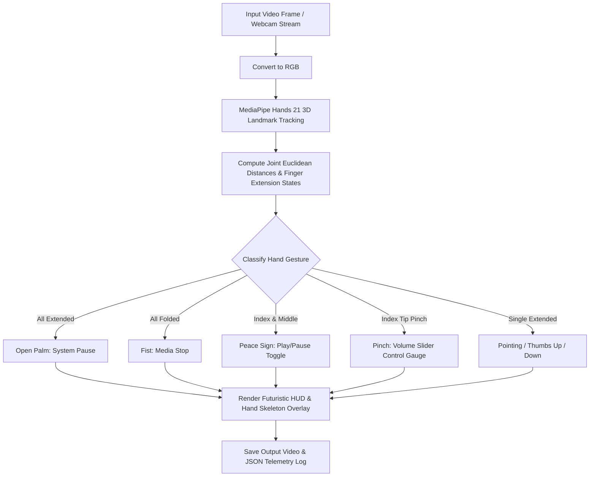

<div align="center">

# 🖐️ Virtual Hand Gesture Controller

### *Day 10 — 30-Day Computer Vision & Deep Learning Challenge*

[](https://www.python.org/)
[](https://mediapipe.dev/)
[](https://opencv.org/)
[](LICENSE)
[](https://github.com/manasha1232)

*Real-time virtual hand gesture recognition and system control engine using 21 3D hand landmarks, finger joint angle geometry, and futuristic HUD overlays.*

---

</div>

## 📌 Overview

The **Virtual Hand Gesture Controller** allows touchless control of media, virtual sliders, and operating system triggers via natural hand gestures captured by a webcam or camera stream. Built using **MediaPipe Hands** and **OpenCV**, it detects 21 3D skeletal hand landmarks, computes finger extension states, and classifies gesture commands with high precision and low latency.

### 🎯 Recognized Gestures & System Triggers

| Gesture | Visual Sign | System Command / Action |
| :--- | :---: | :--- |
| **Open Palm** | 🖐️ | **SYSTEM PAUSE** (Active Neutral Mode) |
| **Fist** | ✊ | **MEDIA STOP** (Reset Controls) |
| **Peace / Victory** | ✌️ | **TOGGLE PLAY / PAUSE** |
| **Pointing Finger** | ☝️ | **VIRTUAL POINTER** (Cursor Tracking) |
| **Pinch Gesture** | 🤏 | **VOLUME SLIDER CONTROL** (Interactive 0–100% Gauge) |
| **Thumbs Up** | 👍 | **CONFIRM / LIKE** |
| **Thumbs Down** | 👎 | **REJECT / DISLIKE** |

---

## 🏗️ System Architecture & Processing Pipeline



---

## 📁 Repository Structure

```text
virtual_hand_gesture_controller/
├── gesture_controller.py      # Core gesture tracking engine & HUD renderer
├── generate_demo_gestures.py  # Synthetic hand gesture dataset generator
├── requirements.txt           # Dependency declarations (opencv-python, mediapipe, numpy)
├── README.md                  # Project documentation
├── input/                     # Input gesture video dataset
│   └── sample_hand_gestures.mp4
└── output/                    # Annotated output video & gesture telemetry JSON
    ├── sample_hand_gestures_gesture_output.mp4
    └── sample_hand_gestures_gesture_report.json
```

---

## ⚡ Quickstart & Installation

### 1. Install Dependencies
```bash
pip install -r requirements.txt
```

### 2. Generate Synthetic Test Gesture Video
```bash
python generate_demo_gestures.py
```

### 3. Run Virtual Hand Gesture Controller
```bash
python gesture_controller.py --input input/sample_hand_gestures.mp4 --output output
```

### 4. Live Webcam Stream Mode
```bash
python gesture_controller.py --input camera
```

---

## 📊 Telemetry Output Specification

```json
{
    "video_source": "sample_hand_gestures",
    "total_frames_processed": 180,
    "total_time_seconds": 2.12,
    "average_fps": 84.9,
    "gesture_frequency": {
        "OPEN_PALM": 180
    },
    "output_video": "output/sample_hand_gestures_gesture_output.mp4"
}
```

---

## 👤 Author & Challenge Context

- **Challenge**: Day 10 of [30-Day Computer Vision & Deep Learning Challenge](https://github.com/manasha1232/30-Day-Computer-Vision-Challenge)
- **Author**: [@manasha1232](https://github.com/manasha1232)
- **License**: MIT License
